# (C# 코딩) 그림판 (Simple Paint)

## 개요
- C# 프로그래밍학습
- 1줄소개: 직선, 사각형, 원을 그릴 수 있는 그림판 프로그램.
- 사용한 플랫폼: 
    - C#, .NET Windows Forms, Visual Studio, GitHub
- 사용한 컨트롤:
    - Label, ComboBox ,GroupBox, PictureBox ,Button, TrackBar
- 사용한 기술과 구현한 기능:
    - Visual Studio를 이용하여 UI 디자인
    - 파일 저장을 위한 대화 상자인 `SaveFileDialog` 사용
    - 마우스 이벤트(MouseDown, MouseMove, MouseUp)를 이용한 드래그 기반 그림 그리기
    - 외부 이미지 파일을 불러와 캔버스로 사용하는 기능 구현

## 실행 화면 (과제1)
- 코드의 실행 스크린샷과 구현 내용 설명

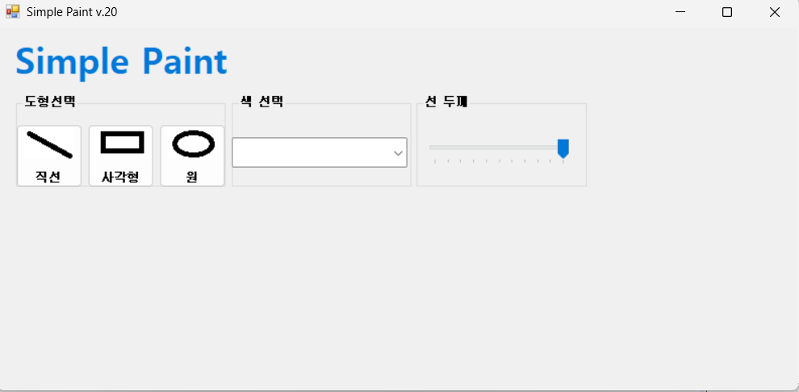
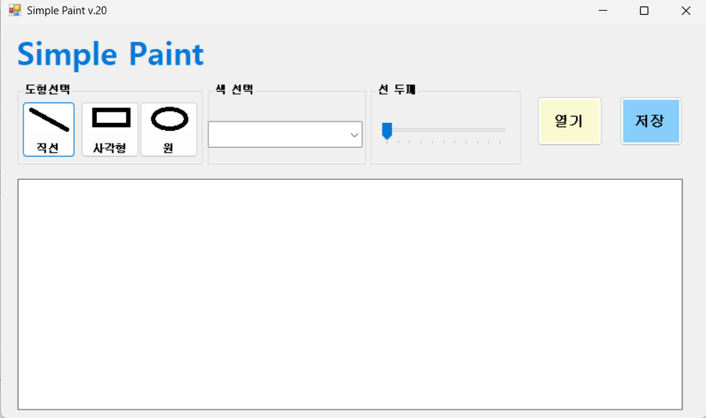
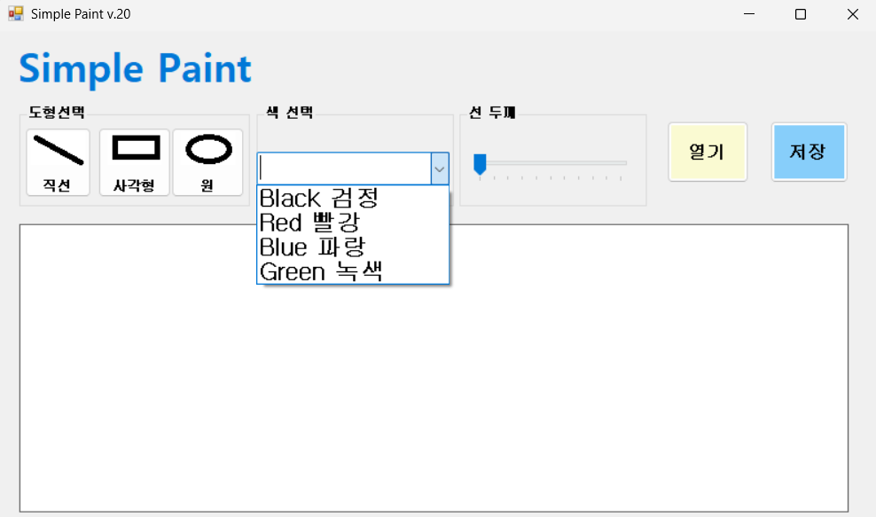
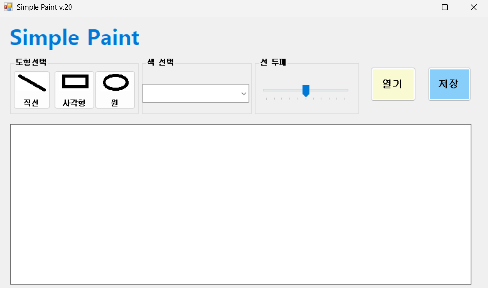

- 과제 내용
    - UI 디자인 및 컨트롤 배치
    - 컨트롤배치를 이용한 도형 선택, 색상 선택, 선 굵기 조절 기능 구현
    - 도형 선택 기능 구현 (선, 사각형, 원)
    - 각각의 컨트롤의 이벤트 핸들러 설정 (예: 버튼 클릭, 트랙바 값 변경 등)

- 구현한 내용 (위 그림 참조)
    - `GroupBox`와 `ComboBox`를 이용하여 도형 선택 UI 구성 (선, 사각형, 원)
    - 색상 선택을 위한 버튼 및 `ColorDialog` 연동
    - `TrackBar`를 이용한 선 굵기 조절 기능 구현
    - `PictureBox`를 캔버스로 설정하여 그림 그리기 영역 구성

## 실행 화면 (과제2)
- 코드의 실행 스크린샷과 구현 내용 설명

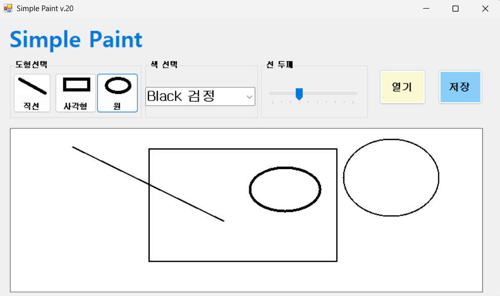
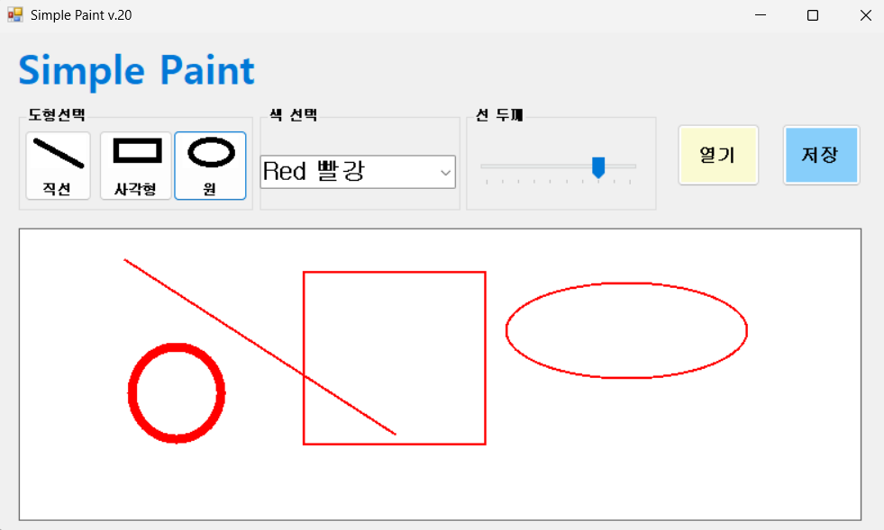
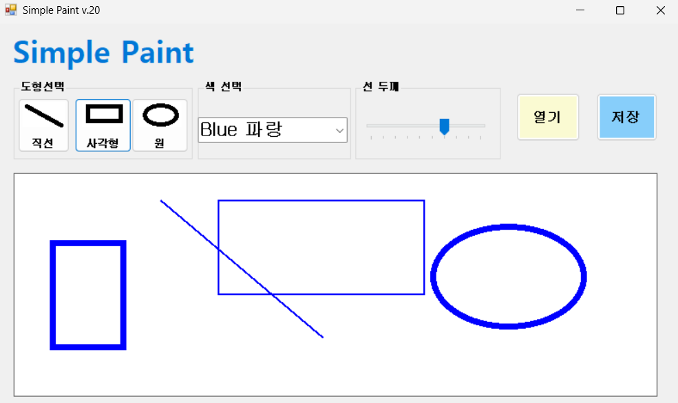
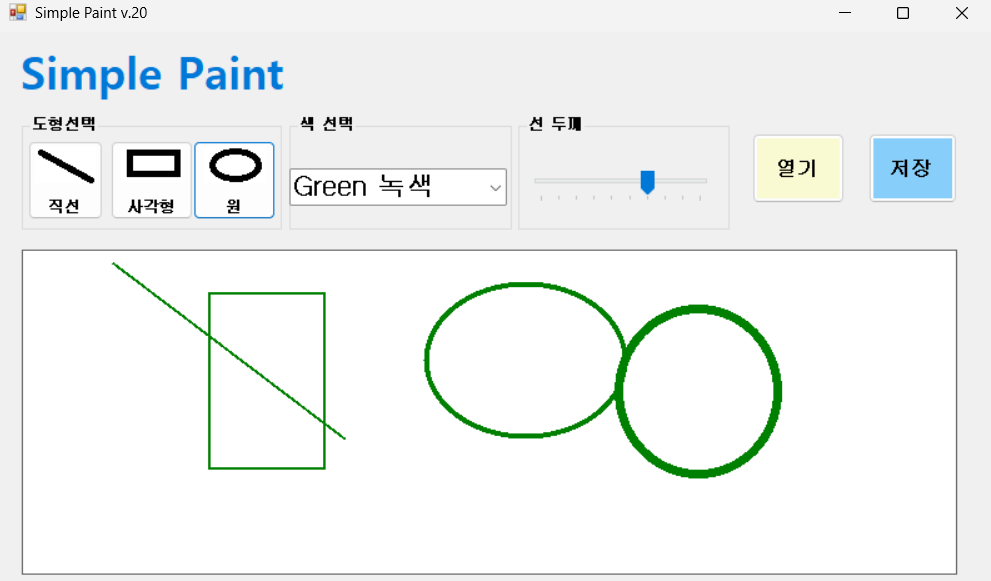

- 과제내용
    - 마우스 이벤트를 활용하여 드래그 기반 그림 그리기 기능 구현
    - 직선, 사각형, 원 그리기 기능 구현
    - 도형 미리보기 기능 구현 (마우스 이동 시 현재 그려지는 도형을 실시간으로 보여주는 기능)

- 구현한 내용 (위 그림 참조)
    - **MouseDown** 시 시작 좌표 저장
    - **MouseMove** 시 현재 좌표를 기반으로 도형 미리보기 구현
    - Graphics 객체를 활용하여 `PictureBox`에 직접 그리기 처리
    - 선택된 도형 타입에 따라 `DrawLine`, `DrawRectangle`, `DrawEllipse` 사용

## 실행 화면 (과제3)
- 코드의 실행 스크린샷과 구현 내용 설명

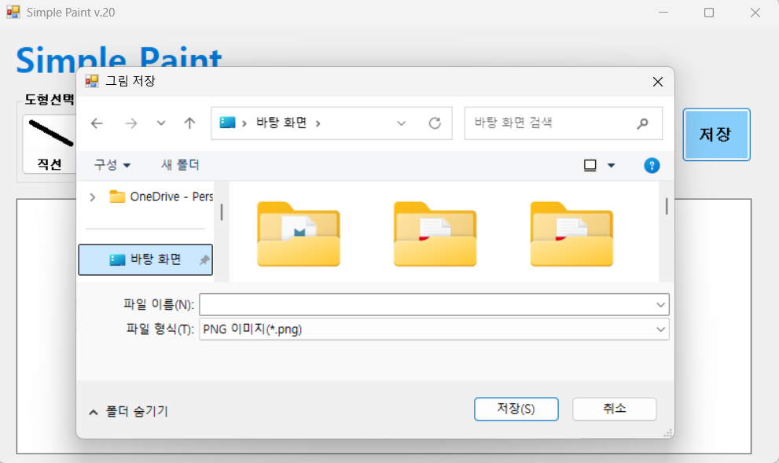
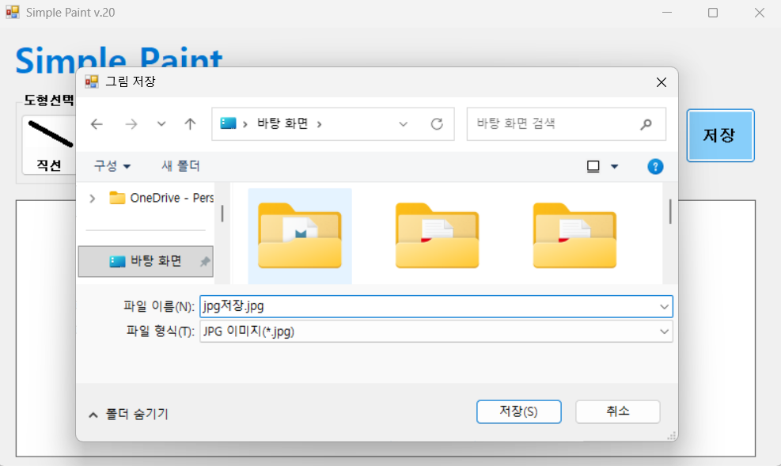
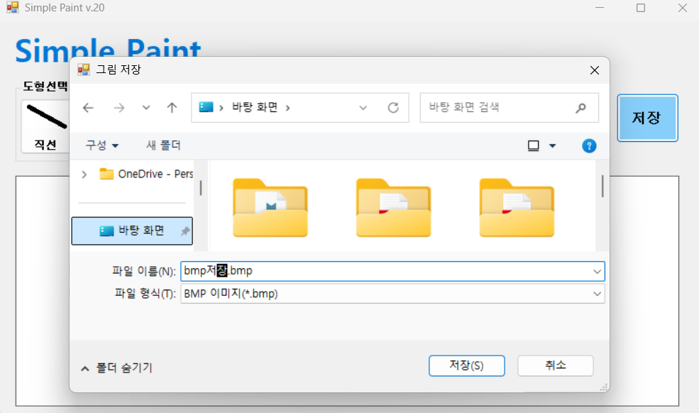
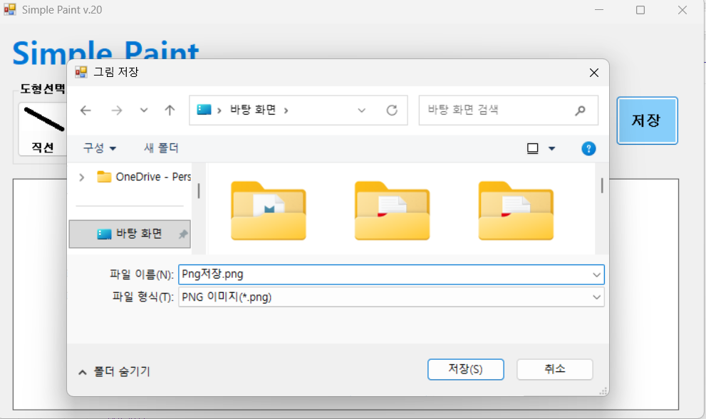

- 과제내용
    - 그림을 파일로 저장하는 기능 구현
    - 다양한 이미지 포맷으로 저장

   
- 구현한 내용 (위 그림 참조)
    - `SaveFileDialog`를 사용하여 파일 저장 경로 및 이름 설정
    - 파일 형식 선택 기능 구현 (.png, .jpg, .bmp)
    - Bitmap 객체를 이용하여 `PictureBox`의 이미지를 파일로 저장

## 실행 화면 (과제4)
- 코드의 실행 스크린샷과 구현 내용 설명

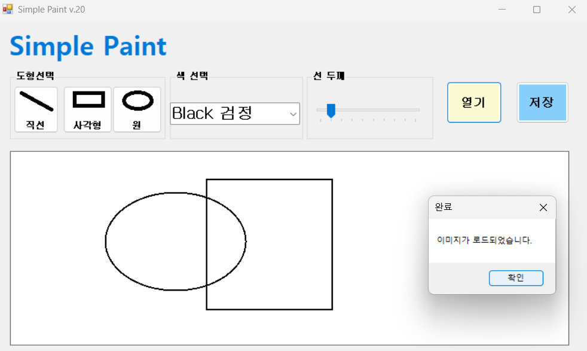
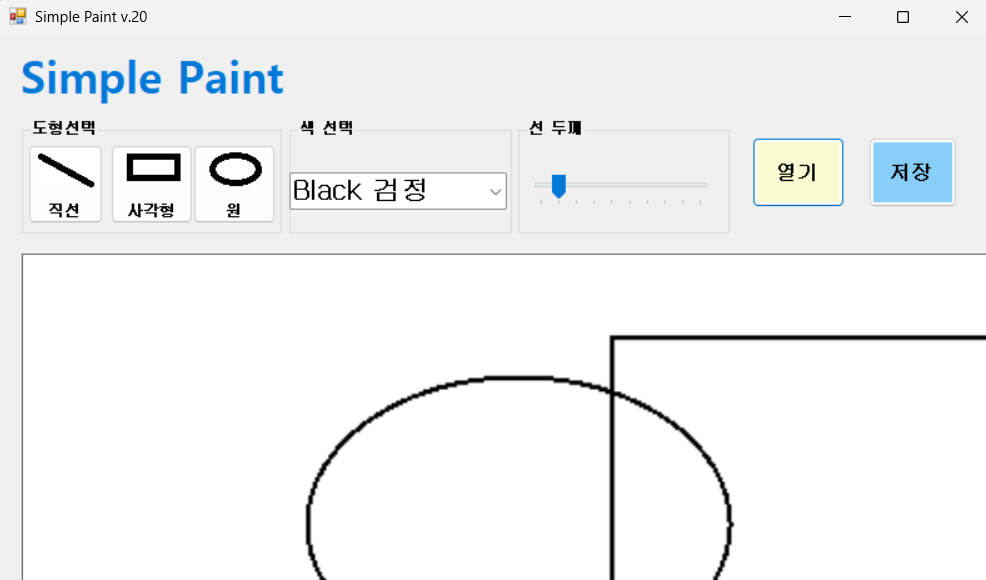
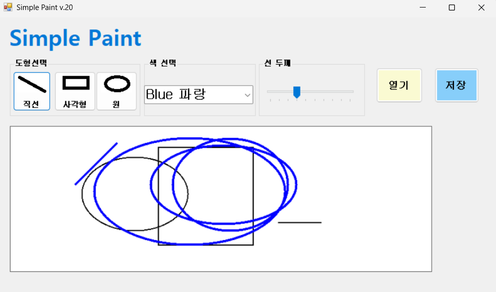
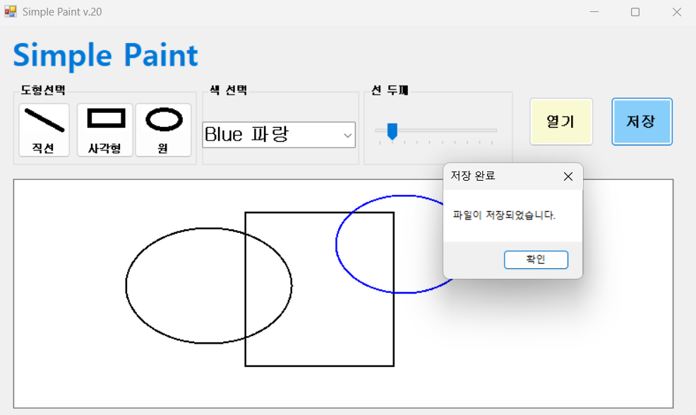

- 과제내용
    - 외부 이미지 파일을 불러와 캔버스로 사용
    - 이미지 크기에 맞는 캔버스 조정
    - 스크롤 기능 및 확대/축소 기능 구현 

- 구현한 내용 (위 그림 참조)
    - `OpenFileDialog`를 사용하여 외부 이미지 파일 불러오기
    - 불러온 이미지를 `PictureBox`에 설정하여 배경으로 사용
    - `Panel`의 AutoScroll 기능을 활용하여 스크롤 구현
    - `TrackBar` 또는 버튼을 이용한 확대/축소 기능 구현 (Zoom 비율 조정)